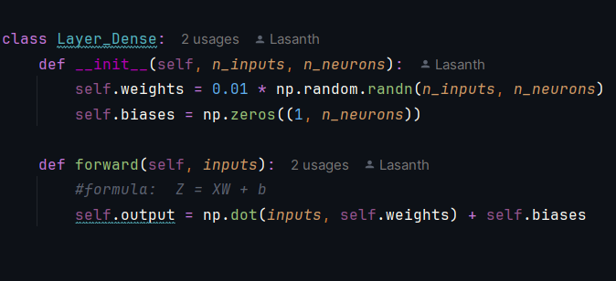
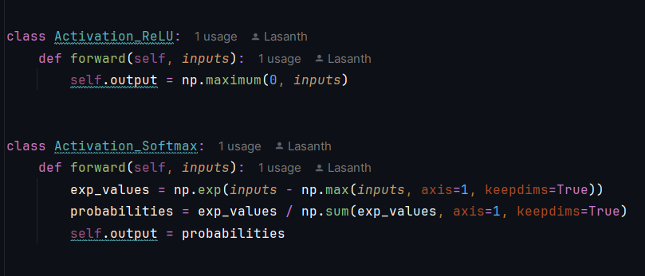
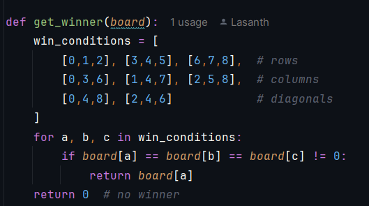
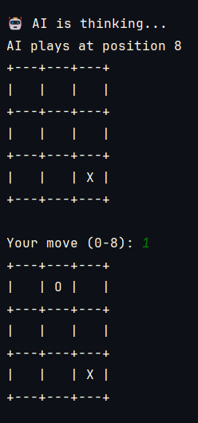

# Tic-Tac-Toe Neural Network

A simple **Tic-Tac-Toe** game where the AI (X) is powered by a **feedforward neural network** built from scratch using only NumPy.

The human player plays as **O**.

---

## Features

- Pure NumPy implementation (no TensorFlow/PyTorch)
- Custom neural network with:
  - Dense layers
  - ReLU activation (hidden layer)
  - Softmax activation (output layer)
- 9 → 32 → 9 architecture
- AI selects the best legal move based on predicted probabilities
- Clean terminal-based board display
- Proper win/draw detection

---

## How It Works

The neural network takes the current board state (9 values: `1` = X, `-1` = O, `0` = empty) as input and outputs a probability distribution over the 9 possible moves. 

The AI always picks the **highest probability legal move**.

> **Note**: The model is initialized with random weights and is **not trained**. It currently plays at a very basic level.

---

## Few previews

- Dense Layer

- Activation functions

- Winning conditions

- Console output

---

## Requirements

- Python 3.x
- NumPy
